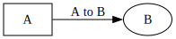

# Rust Bindings to C's GraphViz library
This crate provides bindings and minimal wrapper types for interacting with C graphviz. 

# graphviz
This crate provides an idiomatic Rust wrapper over the Graphviz C libraries (`libgvc` and `libcgraph`),
enabling you to create, layout, and render graphs using Graphviz in a safe and ergonomic way.
## Features
- Construct graphs from DOT source or programmatically
- Add nodes and edges with fine-grained attribute control
- Apply Graphviz attributes using strongly typed enums
- Support for Graphviz layout engines (`dot`, `neato`, `fdp`, etc.)
- Output to formats like `svg`, `png`, `dot`, `json`, and many more
- Extensible trait-based attribute system
- Optional `serde` support for attribute enums

## Example
```rust
use graphviz::*;
use graphviz::style::{NodeAttr, GraphAttr, CommonAttr};
use graphviz::style::shape::NodeShape;
fn main() {
    let ctx = Context::new();
    // Start with an empty directed graph
    let mut graph = Graph::new("digraph G {}", &ctx);
    // Add nodes A and B
    graph.add_node("A");
    graph.add_node("B");
    graph.add_edge("A", "B", "A_to_B");
    // Style node A
    graph.set_attr_on_node("A", NodeAttr::Shape(NodeShape::Box)).unwrap();
    // Label the edge
    graph.set_attr_on_edge("A_to_B", CommonAttr::Label("A to B".into())).unwrap();
    // Set graph-level attributes
    graph.set_attr_on_graph(GraphAttr::RankDir(style::RankDir::LR)).unwrap();
    // Layout the graph using `dot`
    graph.set_layout(Layout::Dot);
    // Render the graph to SVG format
    let svg = ctx.render(&graph, OutputFormat::Svg);
    std::fs::write("example.svg", svg).unwrap();
}
```

### SVG generated by above code:



## Safety
While this crate provides a safe wrapper over unsafe C bindings, all `Graph` objects must be dropped before their parent `Context`.

 ## Optional Features
 -  `serde`: Enables serialization and deserialization for enums like `Layout`, `OutputFormat`, and attribute types.
 -  `bindings`: Enables native C bindings for the use of graphviz, on by default.

## License
Licensed under MIT or Apache-2.0.